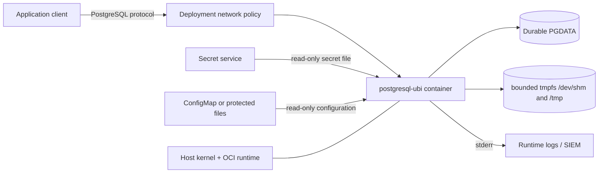
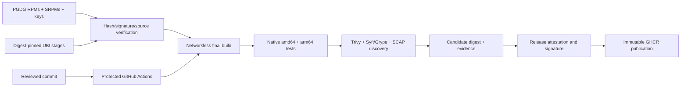
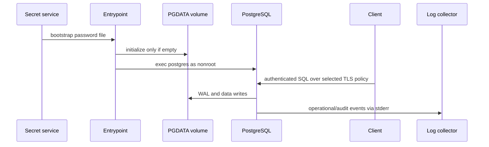
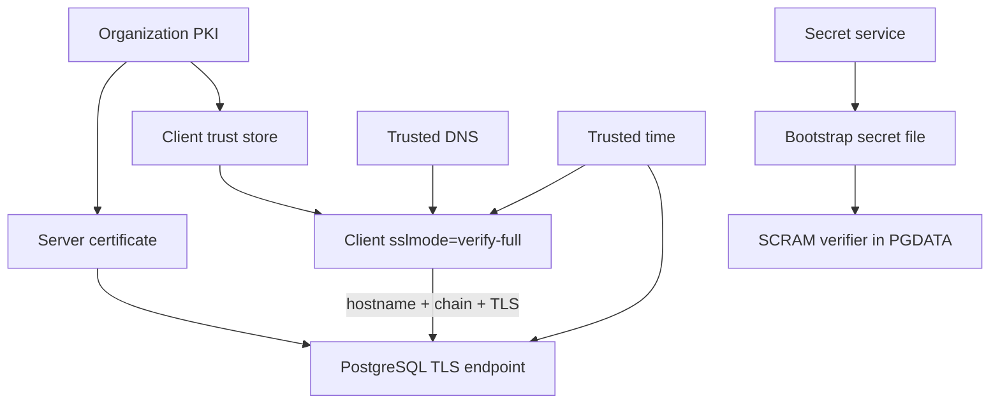
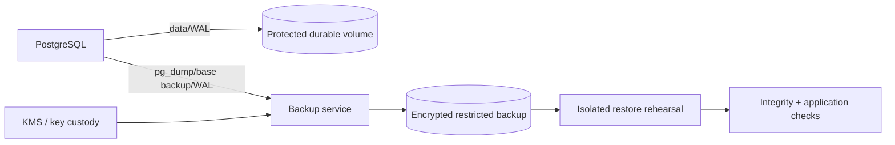
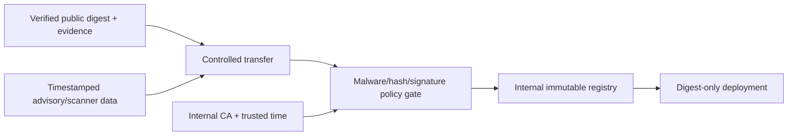
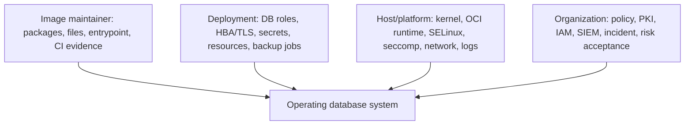

# Security architecture and trust boundaries

These diagrams define ownership and evidence boundaries. Arrows crossing a
boundary require validation; a green build does not make an external service
trusted.

## Component architecture

The image owns packaged files, entrypoint validation, and safe defaults. The
deployment owns configuration, identities, listeners, secrets, data, and
resources. The host/platform owns kernel isolation, SELinux, seccomp, cgroups,
network enforcement, and log transport.

## Build and assurance pipeline

Untrusted pull-request code never receives release credentials. Locks,
publisher keys, action commits, scanner versions, evidence, tags, and registry
digests are substitution targets and require independent verification.

## Runtime data flow

Initialization consumes the secret without copying it into the image or
command line. Existing data bypasses bootstrap; operators own continuing role
and secret lifecycle.

## Credential and TLS trust

PKI, DNS, clock, client verification, rotation, and revocation are outside the
image. SCRAM does not replace server authentication.

## Storage and backup flow

The image provides database mechanics only. Volume durability, backup
consistency, encryption, access, retention, off-site custody, restore testing,
RPO, and RTO are organization responsibilities.

## Controlled-network acquisition

The internal digest mapping, feed age, transfer custody, CA, trusted time,
rollback availability, and registry immutability must be recorded.

## Control ownership

No single component artifact establishes system control effectiveness.
